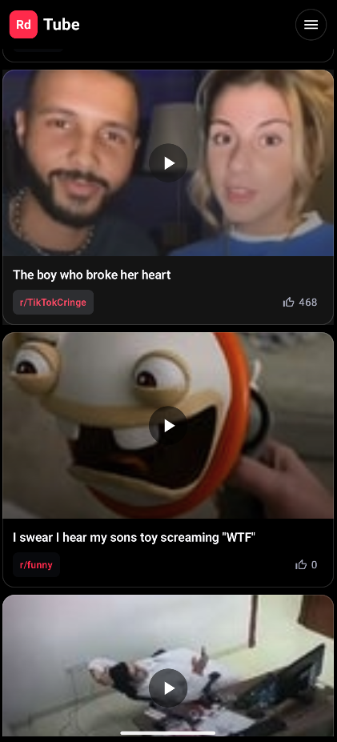
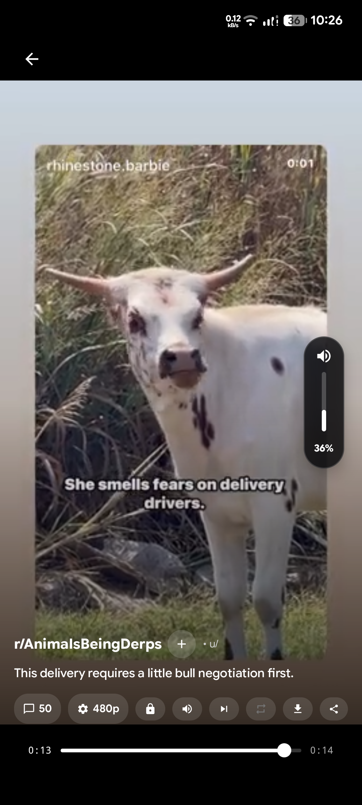
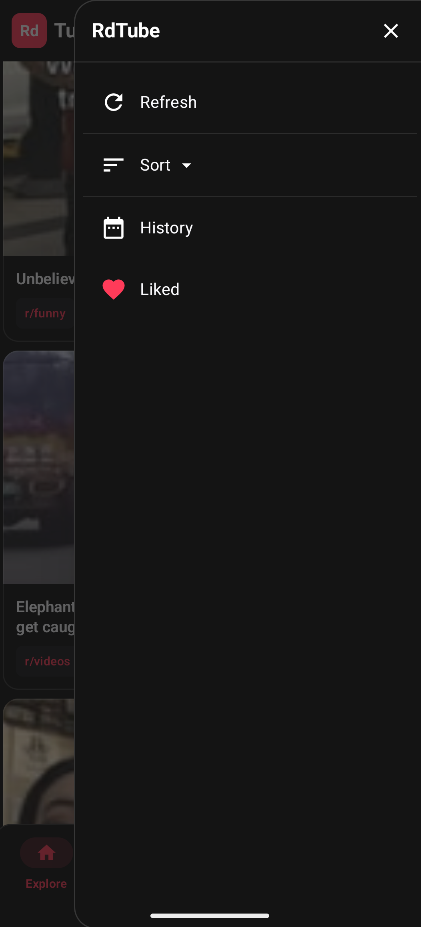
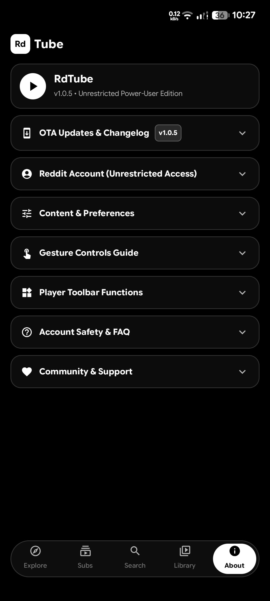
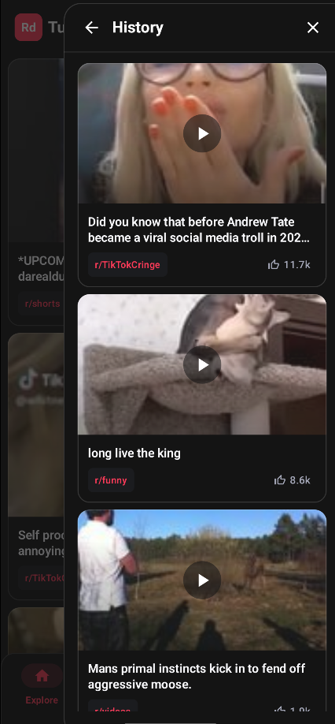

# RdTube

<picture>
  <source media="(prefers-color-scheme: dark)" srcset="docs/images/rdtube_banner_dark.svg">
  <source media="(prefers-color-scheme: light)" srcset="docs/images/rdtube_banner_light.svg">
  
</picture>

<div align="center">

[](https://github.com/LeanBitLab/RdTube/releases/latest)
[](https://github.com/LeanBitLab/RdTube/releases)
[](https://github.com/LeanBitLab/RdTube/stargazers)
[](https://www.gnu.org/licenses/gpl-3.0)
[](https://github.com/sponsors/LeanBitLab)
[](https://opencollective.com/leanbitlab-org)

**A private, fast, and sleek open-source video client for Reddit.**  
*Pure OLED pitch black, high-speed feed prefetching, and zero tracking.*

[Screenshots](#-screenshots) • [Download](#-download) • [Features](#-features) • [Setup & Building](#-setup--building) • [Notes & Privacy](#-notes--privacy) • [LeanBitLab Projects](https://github.com/LeanBitLab#-android-projects)

</div>

---

## 🚀 Overview

**RdTube** is a modern, privacy-respecting video client for Reddit crafted in 100% Kotlin & Jetpack Compose. Engineered with a hardware-accelerated Media3 ExoPlayer engine, RdTube turns Reddit video browsing into a high-speed, clutter-free YouTube Shorts-style experience.

---

## 📸 Screenshots

<table>
  <tr>
    <td></td>
    <td></td>
    <td></td>
    <td></td>
    <td></td>
  </tr>
</table>

---

## ✨ Features

- **Media3 ExoPlayer Engine**: Silky-smooth 60fps streaming with dynamic prefetching and lifecycle-aware memory management.
- **Continuous Edge Gestures**: Ultra-smooth vertical drag sliders for screen brightness (left) and media volume (right).
- **Playback Controls**: Single-video loop toggle, auto-next advance, playback speed (0.5x–2.0x), and resolution selection.
- **Direct Video Export**: Download full MP4 videos directly to device storage with merged high-bitrate audio.
- **High-Density Video Feeds**: Parallel coroutine fetching across top video subreddits for immediate 25+ card feeds.
- **Comprehensive Feed Sorting**: 1-tap sheet supporting Hot, New, Rising, and Top (Today, Week, Month, Year, All-Time).
- **Segmented Search & Pagination**: Search communities or Reddit-wide video clips with live suggestions and infinite scroll.
- **5-Slot Floating Dock**: Snappy navigation bar with 850f spring physics (Explore, Subs, Search, Library, About).
- **Double-Back Exit**: Intuitive swipe/press-back-twice safety mechanism to prevent accidental app exits.
- **Intelligent Cache Freshness**: Instant zero-latency cached feed display with 5-minute freshness management.
- **Pitch Black OLED Aesthetic**: Pure monochrome black theme optimized for battery saving on AMOLED displays.
- **100% Strictly Local Storage**: Likes, watch history, and subscriptions are saved locally in private storage—never tracked or uploaded.

---

## 📥 Download

<table border="0">
  <tr>
    <td align="center" valign="middle">
      <a href="https://github.com/LeanBitLab/RdTube/releases/latest">
        
      </a>
    </td>
    <td align="center" valign="middle">
      <a href="https://apps.obtainium.imranr.dev/redirect.html?r=obtainium://add/https://github.com/LeanBitLab/RdTube">
        
      </a>
    </td>
  </tr>
</table>

---

## 🛠️ Setup & Building

### Prerequisites
- **Android Studio**: Ladybug / Meerkat or newer
- **JDK**: Java 17 or higher
- **Android SDK**: API 36 (Minimum Supported: API 24 / Android 7.0+)

### Building from Source
```bash
# Clone the repository
git clone https://github.com/LeanBitLab/RdTube.git
cd RdTube

# Build Debug APK
./gradlew assembleDebug

# Run Unit Tests
./gradlew test
```

---

## 📝 Notes & Privacy

- **100% Community Funded**: RdTube is completely independent, free, and open-source with zero advertisements, sponsors, or analytics.
- **Official Read-Only OAuth 2.0**: Unrestricted and mature subreddits require Reddit authentication. RdTube uses standard read-only scopes (`identity`, `read`, `mysubreddits`) directly in your browser. Passwords are never seen or stored.
- **Zero Cloud Syncing**: Connecting an account serves solely to authenticate API media streaming. It never modifies, overwrites, or syncs your Reddit upvotes, saved items, or history.
- **Account Usage Precaution**: While read-only OAuth is standard under Reddit's developer API, Reddit policies can change. If you prefer extra caution, you can use a secondary Reddit account or browse 100% anonymously without logging in.
- **In-App OTA Updates**: Built-in GitHub Releases update checker in the About page notifies you of new versions and downloads APKs with a single tap.

---

## 📱 More Android Projects by LeanBitLab

Discover our complete suite of privacy-first, open-source Android applications:  
👉 **[Explore All LeanBitLab Android Projects](https://github.com/LeanBitLab#-android-projects)**

---

## 🤝 Community & Contributing

- **Bug Reports & Issues**: [Open an Issue on GitHub](https://github.com/LeanBitLab/RdTube/issues)
- **Official Telegram Channel**: [@LeanBitLab](https://t.me/LeanBitLab)
- **Reddit Community**: [r/LeanBitLab_](https://www.reddit.com/r/LeanBitLab_/)
- **X (Twitter)**: [@LeanBitLab](https://x.com/LeanBitLab)
- **YouTube**: [@LeanBitLab](https://www.youtube.com/@LeanBitLab)
- **Website**: [leanbitlab.github.io](https://leanbitlab.github.io/LeanBitLab/)

---

## 💖 Support the Project

If RdTube improves your daily video browsing, please consider supporting our independent development:

<div align="left">
  <a href="https://github.com/sponsors/LeanBitLab">
    
  </a>
  &nbsp;&nbsp;
  <a href="https://opencollective.com/leanbitlab-org">
    
  </a>
</div>

---

## ⚖️ License

RdTube is licensed under the **GNU General Public License v3.0 (GPL-3.0)**.  
See the [LICENSE](LICENSE) file for details.
